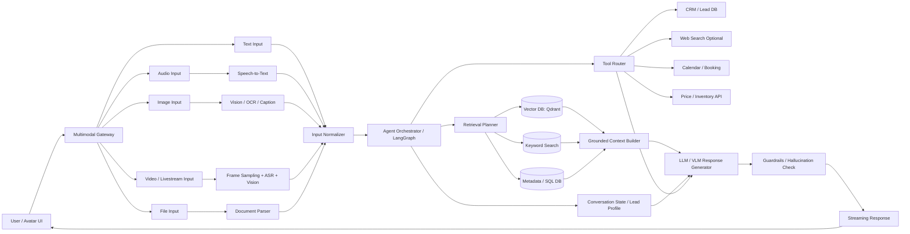
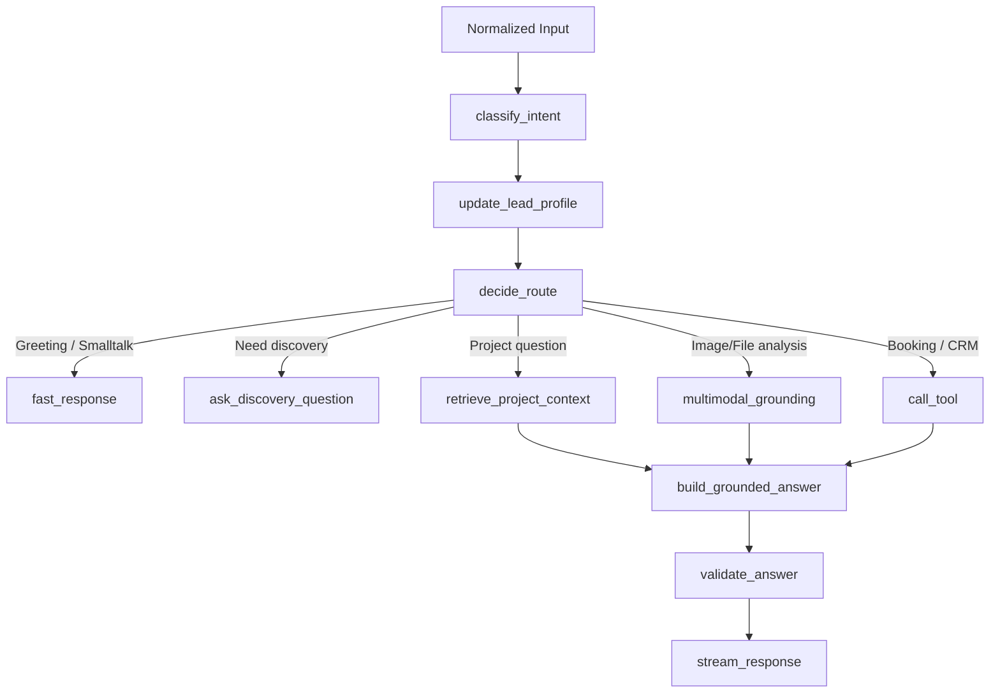
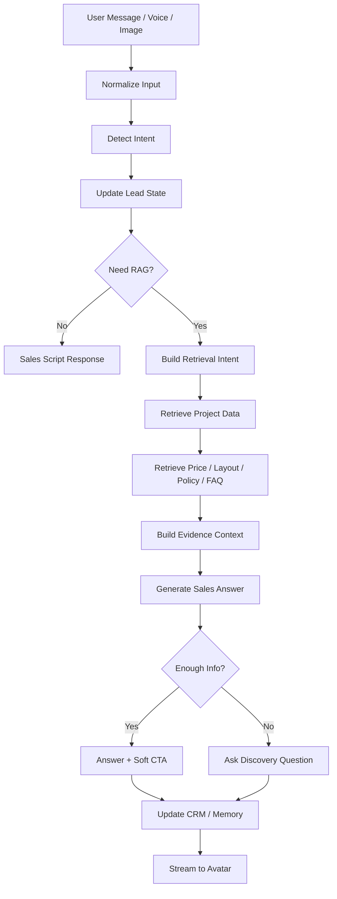
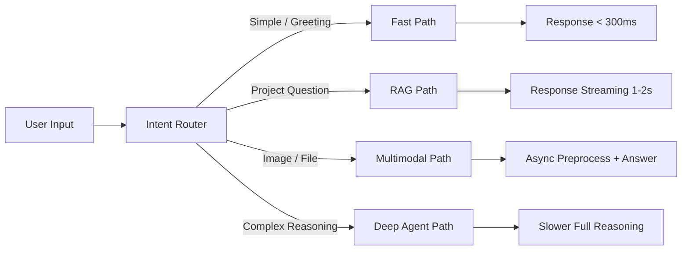
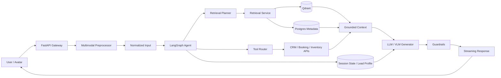

Kiến trúc của một hệ thống **Agentic RAG multimodal input** là hệ thống cho phép user đưa vào **text, voice, image, video, file**, sau đó agent tự quyết định: cần hiểu input bằng model nào, cần retrieve dữ liệu nào, cần gọi tool nào, rồi sinh câu trả lời có grounding.

Với case của bạn: **AI sales bất động sản + avatar realtime + RAG dự án**, kiến trúc nên tách thành nhiều layer như sau.

---

## 1. Tổng quan kiến trúc



---

## 2. Các layer chính

### Layer 1: Multimodal Input Gateway

Đây là cổng nhận mọi loại input từ user.

Ví dụ:

```text
Text: "Dự án này có căn 2PN không?"
Voice: audio từ avatar/livechat
Image: ảnh mặt bằng, ảnh căn hộ, bảng giá
Video: livestream, camera, screen share
File: PDF, Excel, brochure, hợp đồng, bảng hàng
```

Nhiệm vụ của gateway là **không xử lý logic sales**, chỉ chuẩn hóa input và gửi xuống tầng hiểu dữ liệu.

---

### Layer 2: Multimodal Understanding

Mỗi loại input cần bộ xử lý riêng:

| Input | Module xử lý              | Output chuẩn hóa               |
| ----- | ------------------------- | ------------------------------ |
| Text  | Text normalizer           | `user_text`                    |
| Audio | ASR / Speech-to-text      | transcript                     |
| Image | OCR + VLM captioning      | mô tả ảnh + text OCR           |
| Video | tách frame + ASR + vision | transcript + scene description |
| File  | parser PDF/Excel/Docx     | markdown chunks                |

Ví dụ user gửi ảnh bảng giá, hệ thống nên biến thành:

```json
{
  "input_type": "image",
  "ocr_text": "Căn 2PN, 68m2, giá 3.2 tỷ...",
  "visual_description": "Ảnh chụp bảng giá căn hộ, có các cột mã căn, diện tích, giá bán",
  "detected_intent": "ask_project_price"
}
```

Sau đó agent mới xử lý như một query bình thường.

---

## 3. Agent Orchestrator

Đây là phần “agentic”.

Không chỉ retrieve rồi trả lời, mà agent sẽ tự quyết định:

```text
User đang hỏi gì?
Có cần RAG không?
Có cần hỏi thêm thông tin không?
Có cần gọi tool không?
Có cần phân tích ảnh/file không?
Có cần chuyển sang workflow sales không?
```

Với hệ thống của bạn, layer này có thể dùng **LangGraph**.

Ví dụ node:



Điểm quan trọng: **LLM không nên tự do quyết định toàn bộ flow sales**. Nên để code/LangGraph kiểm soát:

```text
state -> script_step -> response_action -> output
```

Như hướng bạn đang làm là đúng.

---

## 4. Retrieval Layer cho multimodal RAG

Multimodal RAG không chỉ có text vector.

Nên có nhiều index:

```text
1. Text index
   - markdown dự án
   - bảng giá
   - tiện ích
   - chính sách bán hàng
   - FAQ

2. Image index
   - ảnh mặt bằng
   - ảnh phối cảnh
   - ảnh nội thất
   - ảnh brochure

3. OCR index
   - text trích từ ảnh/PDF

4. Metadata index
   - tên dự án
   - loại căn
   - diện tích
   - giá
   - block/tầng
   - trạng thái hàng

5. Conversation memory
   - nhu cầu khách
   - ngân sách
   - khu vực quan tâm
   - số phòng ngủ
   - mục đích mua
```

Một record trong Qdrant có thể dạng:

```json
{
  "id": "noble_project_price_2pn_001",
  "content": "Căn 2PN diện tích 68m2, giá từ 3.2 tỷ...",
  "modality": "text",
  "source_type": "price_sheet",
  "project": "Noble",
  "unit_type": "2PN",
  "area": "68m2",
  "price": "3.2 tỷ",
  "embedding_type": "text_embedding"
}
```

Với ảnh:

```json
{
  "id": "layout_2pn_image_001",
  "content": "Mặt bằng căn 2PN gồm 2 phòng ngủ, 2 WC, logia...",
  "modality": "image",
  "image_url": "/assets/layout_2pn.png",
  "ocr_text": "2PN - 68m2",
  "project": "Noble",
  "unit_type": "2PN",
  "embedding_type": "image_or_caption_embedding"
}
```

---

## 5. Agentic RAG khác RAG thường ở đâu?

RAG thường:

```text
User query -> retrieve -> LLM answer
```

Agentic RAG:

```text
User multimodal input
-> hiểu input
-> phân loại intent
-> kiểm tra state khách hàng
-> quyết định có retrieve không
-> chọn collection/index/tool phù hợp
-> có thể hỏi thêm nếu thiếu thông tin
-> retrieve nhiều bước
-> gọi tool/API nếu cần
-> sinh câu trả lời có grounding
-> cập nhật memory/CRM
```

Ví dụ:

User hỏi:

```text
"Căn này còn không?"
```

RAG thường sẽ không biết “căn này” là căn nào.

Agentic RAG sẽ kiểm tra context:

```text
- User vừa gửi ảnh bảng giá?
- User đang xem căn 2PN?
- Lead profile đang quan tâm ngân sách 3 tỷ?
- Cần gọi inventory API không?
```

Sau đó mới trả lời.

---

## 6. Flow thực tế cho AI sales bất động sản



Ví dụ output tốt:

```text
Dạ căn 2PN bên dự án này hiện có nhóm diện tích khoảng 68m2. 
Với ngân sách khoảng 3.2 - 3.5 tỷ thì mình có thể cân nhắc các căn tầng trung để tối ưu view và giá.

Anh/chị đang ưu tiên mua để ở hay đầu tư cho thuê ạ?
```

Ở đây agent vừa trả lời dựa trên RAG, vừa tiếp tục follow workflow sales.

---

## 7. Các service nên tách riêng

Với hệ thống của bạn, có thể tách như sau:

```text
1. avatar-ui / client
   - chat realtime
   - voice input
   - image upload
   - streaming response

2. orchestrator-service
   - LangGraph
   - sales state machine
   - intent routing
   - response action

3. retrieval-service
   - query rewrite
   - vector search
   - hybrid search
   - rerank optional
   - context builder

4. multimodal-service
   - ASR
   - OCR
   - image caption
   - video frame understanding

5. ingest-service
   - parse PDF/Excel/Docx/Image
   - chunking
   - embedding
   - write to Qdrant

6. memory-service
   - lead profile
   - conversation summary
   - session state
   - CRM sync

7. model-serving
   - LLM
   - embedding model
   - reranker
   - VLM
   - ASR
```

---

## 8. Kiến trúc tối ưu latency

Vì bạn cần nối với **interactive avatar realtime**, nên không nên xử lý tất cả theo một pipeline nặng.

Nên chia thành 2 path:



### Fast path

Dùng cho:

```text
"hello"
"tư vấn giúp tôi"
"bạn là ai"
"ok"
"cảm ơn"
```

Không cần RAG. Trả lời bằng template hoặc small LLM cực nhanh.

### RAG path

Dùng cho:

```text
"giá căn 2PN bao nhiêu?"
"chính sách thanh toán thế nào?"
"dự án có tiện ích gì?"
```

Retrieve từ Qdrant, sau đó LLM sinh câu trả lời.

### Multimodal path

Dùng cho:

```text
User gửi ảnh bảng giá
User gửi ảnh mặt bằng
User gửi file PDF
User gửi video/livestream
```

Cần OCR/VLM trước, rồi mới RAG.

### Deep agent path

Dùng cho task phức tạp:

```text
"So sánh 3 căn phù hợp nhất với ngân sách 4 tỷ, ưu tiên cho thuê, gần trường học"
```

Path này có thể gọi nhiều tool và retrieve nhiều vòng.

---

## 9. Stack đề xuất cho hệ thống của bạn

Với hướng bạn đang build, stack hợp lý là:

```text
API:
- FastAPI

Agent orchestration:
- LangGraph

Vector DB:
- Qdrant

Text RAG:
- Qdrant hybrid search
- BM25 optional
- reranker optional

Multimodal:
- OCR: PaddleOCR hoặc EasyOCR
- ASR: Whisper / faster-whisper
- Image understanding: Qwen2.5-VL, InternVL, Gemini Vision API, GPT vision API
- Image embedding: CLIP/SigLIP nếu cần search ảnh

Data ingest:
- Haystack / custom parser
- Markdown chunking
- metadata normalization

Storage:
- PostgreSQL: lead profile, CRM, inventory metadata
- Redis: session cache, fast state, response cache
- MinIO/S3/local storage: image, video, PDF assets

Serving:
- Ollama / vLLM / SGLang / llama.cpp tùy model
```

---

## 10. Bản kiến trúc rút gọn cho README



---

## 11. Nguyên tắc thiết kế quan trọng

Không nên để VLM/LLM xử lý tất cả trực tiếp. Hãy biến mọi input thành dạng chuẩn:

```json
{
  "text": "...",
  "intent": "...",
  "entities": {},
  "modality": "text | audio | image | video | file",
  "session_state": {},
  "retrieval_intent": {}
}
```

Sau đó LangGraph quyết định route.

Kiến trúc tốt nhất cho bạn là:

```text
Multimodal Input
-> Normalize
-> Sales State Machine
-> Retrieval Planner
-> Qdrant / Tool / CRM
-> Grounded LLM Response
-> Stream to Avatar
```

Điểm cốt lõi: **multimodal chỉ là đầu vào**, còn phần giữ workflow sales phải nằm ở **agent orchestrator/state machine**, không để model tự chạy lung tung.
